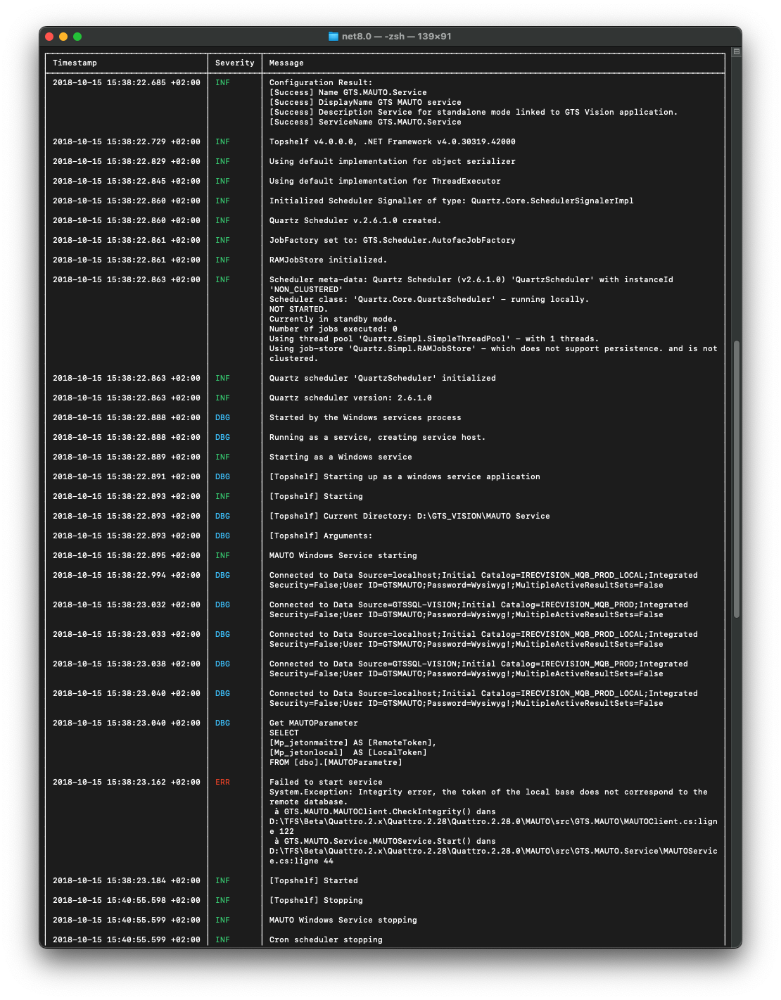

# Analog - Log Analysis

Powerful utility designed to help you make sense of your application and system logs. Whether
you're troubleshooting issues, monitoring performance, or auditing security events, this tool provides the capabilities
you need to efficiently analyze log files.

## Features

- **Templates**: Easily parse logs from various sources, including application logs, system logs, web server
  logs, and more... using built-in or custom log templates.
- **Filtering**: Filter logs using **Language-Integrated Query (LINQ) Expression** syntax. Create complex and
  customizable filters to precisely extract the information they need from log files.

## License

This project is licensed under the MIT License - see the [LICENSE](./LICENSE) file for details.
